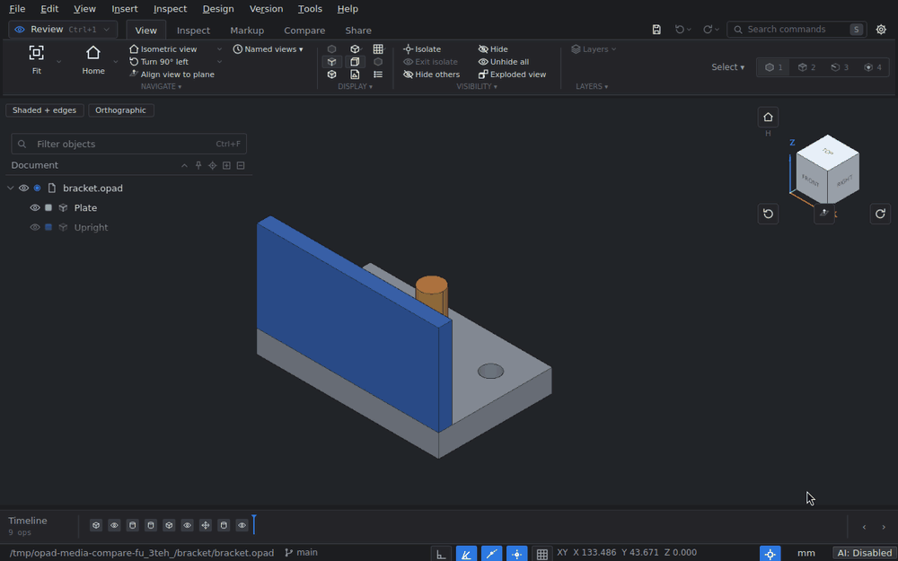
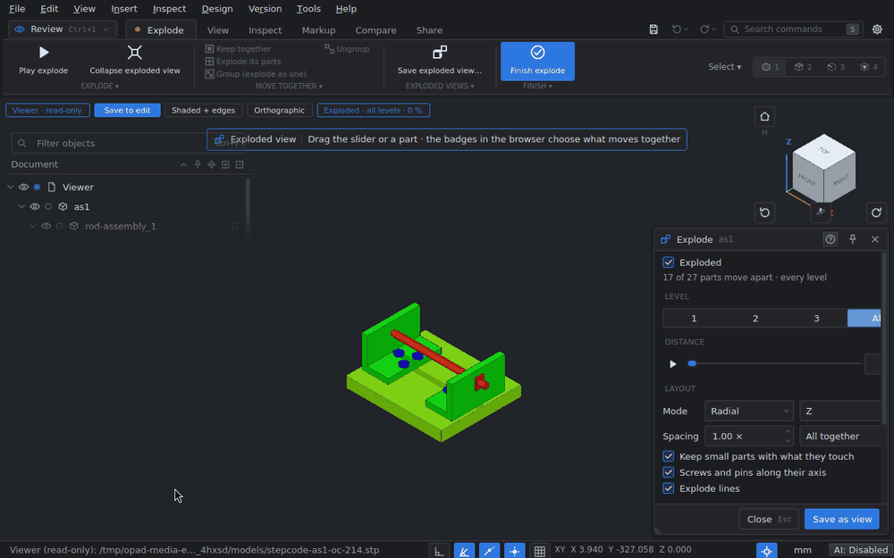
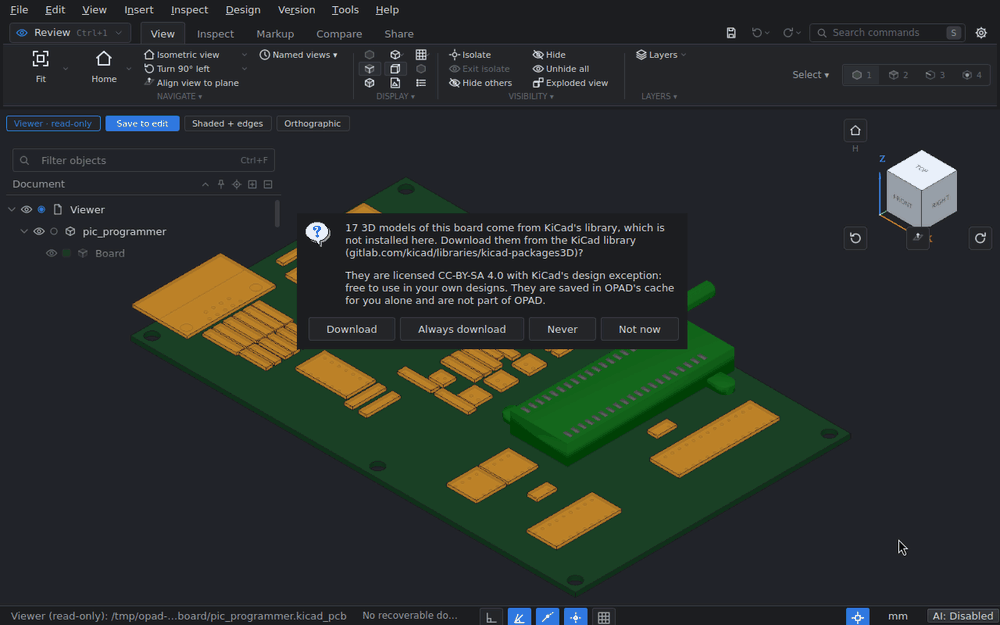
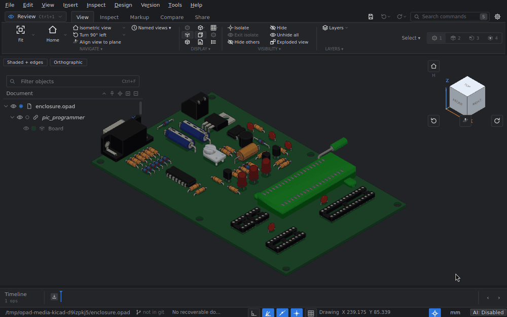
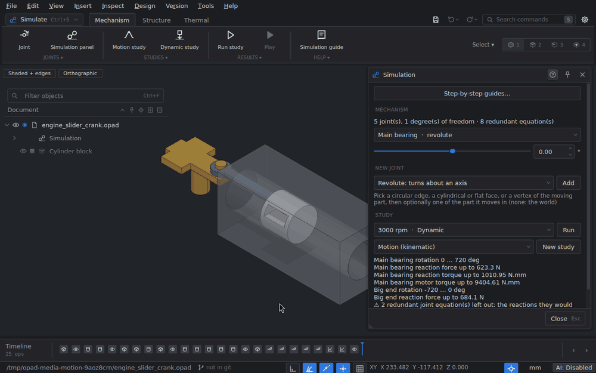
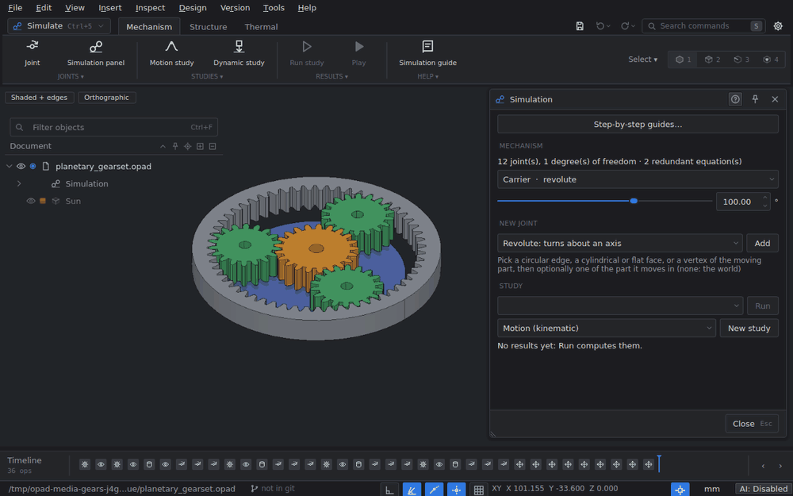
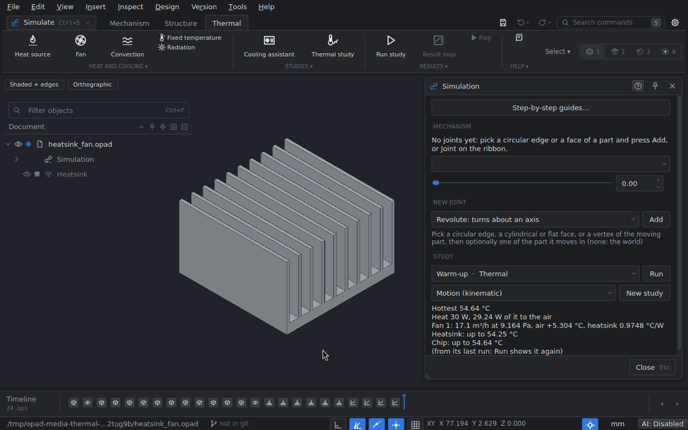

<div align="center">
  <picture>
    <source media="(prefers-color-scheme: dark)" srcset="docs/media/opad-logo-dark.png">
    
  </picture>
  <br>
  <br>
  <b dir="rtl">برنامج تصميم بارامتري مفتوح المصدر، ملفاته يقارنها git ويدمجها.</b>
  <br>
  <br>

  [English](README.md) · **العربية**
  <br>
  <br>

  
  
  
  
  
  
</div>

<p align="center">
  
</p>

<div dir="rtl">

**OPAD** (اختصار **O**pen-source **P**arametric C**AD**، أي برنامج تصميم بارامتري مفتوح المصدر) برنامج تصميم
ثلاثي الأبعاد لكل المستويات، من شخص يرسم أول رسم تخطيطي له إلى مهندس يعمل على تجميعة من ألف قطعة. يفتح الرسومات
ثنائية الأبعاد والنماذج ثلاثية الأبعاد والشبكات، وينقلك من الرسم التخطيطي إلى المجسم مع سجل خطوات يبقى قابلاً
للتحرير، ويحفظ التصميم كله في ملف نصي واحد **يستطيع git مقارنته ودمجه**. ويمكن لوكلاء الذكاء الاصطناعي العمل على
النموذج في النافذة نفسها التي تستخدمها، وكل أمر في البرنامج يعمل أيضاً من سطر الأوامر.

يعمل على جهازك أنت، بلا حساب ولا خادم، وهو مبني على Open CASCADE وQt.

## المحتويات

- [المزايا](#المزايا)
  - [إدارة النسخ مع git](#إدارة-النسخ-مع-git)
  - [فتح الملفات](#فتح-الملفات)
  - [من ثنائي الأبعاد إلى ثلاثي الأبعاد](#من-ثنائي-الأبعاد-إلى-ثلاثي-الأبعاد)
  - [الرسومات الفنية](#الرسومات-الفنية)
  - [الملاحظات والتعليقات والرسم اليدوي](#الملاحظات-والتعليقات-والرسم-اليدوي)
  - [التكامل مع KiCad](#التكامل-مع-kicad)
  - [الحركة والمحاكاة (تجريبية)](#الحركة-والمحاكاة-تجريبية)
  - [الأداء مع النماذج والرسومات الكبيرة](#الأداء-مع-النماذج-والرسومات-الكبيرة)
- [التكامل: وكلاء الذكاء الاصطناعي وسطر الأوامر وبايثون](#التكامل-وكلاء-الذكاء-الاصطناعي-وسطر-الأوامر-وبايثون)
- [اللغات](#اللغات)
- [المنصات المدعومة](#المنصات-المدعومة)
- [التثبيت](#التثبيت) · [الاستخدام](#الاستخدام) · [المساهمة](#المساهمة) · [أسئلة شائعة](#أسئلة-شائعة) · [الترخيص](#الترخيص)

## المزايا

### إدارة النسخ مع git

معظم ملفات CAD ثنائية (binary): يخزّنها git، لكنه لا يستطيع أن يخبرك بما تغيّر بين نسختين، وإذا عدّل شخصان القطعة
نفسها فلا سبيل لدمج عملهما. صيغة ملف OPAD صُمّمت لتجعل git قادراً على الأمرين.

#### ملف يقرؤه git

ملف `.opad` نص UTF-8 من جزأين: **سجل عمليات** (سجل JSON لكل رسم تخطيطي وميزة وملاحظة وإعادة تسمية...) و**مخزن
أجسام** يُحفظ فيه كل جسم مرة واحدة نصَّ BREP تحت بصمة SHA-256 لمحتواه. الحفظ يضيف سجلات جديدة ولا يعيد كتابة القديمة،
والجسم الذي لم يتغيّر يحتفظ بمفتاحه. لذلك لا يُظهر الفرق إلا ما فعلته أنت، لا ملفاً أُعيد ترتيبه.

</div>

```text
#opad 2
{"uuid":"7c1c...","units":"mm","created":"2026-09-15T14:10:40Z","generator":"opad/0.1.0"}
#ops
{"op":"import","id":"6dda...","by":"alice","source":"gearbox.step","units":"mm","nodes":[...]}
{"op":"annotation","id":"1ffe...","by":"alice","anchor":{"body":"9dc9...","kind":"face","index":12},"text":"deburr"}
#bodies
#body a0d6fc12...058d 310 {"name":"Housing","color":[0.2,0.5,0.8],"units":"mm","source":"gearbox.step"}
...OCCT ASCII BREP...
```

<div dir="rtl">

والصيغة آمنة بين الإصدارات أيضاً: السجلات التي لا يعرفها إصدار ما تُحفظ كما هي، وتُعرض على أنها تحتاج إصداراً أحدث من
OPAD، وتُكتب عند الحفظ دون تغيير. يشرح [docs/format.md](docs/format.md) الصيغة.

#### فروق مقروءة

يقارن `opad-cli diff` بين نسختين (ملفين، أو ملف وأي مراجعة في git) بلغة التصميم. هنا غيّر بوب معامل الارتفاع
`height` في القطعة التي صمّمتها أليس:

</div>

```text
$ opad-cli diff --a git:HEAD~1 bracket.opad --text
b continues a: 2 ops in common, 2 new.
Parameters
  ~ height: 25 mm -> 40 mm
Features
  ~ Bracket: regenerated
Bodies
  ~ Bracket: geometry changed (b6b0f6452a39 -> 6cd23d2ec334)
```

<div dir="rtl">

وعند إعداد `textconv` الخاص بـ OPAD، تعرض أوامر git العادية (`git diff` و`git log -p` و`git show`) ملخصاً مقروءاً من
النوع نفسه (السجل والمعاملات والرسومات التخطيطية والميزات والشجرة وسطر لكل جسم) بدلاً من نص BREP.

#### الدمج

أداة دمج تفهم سجلات OPAD (مدمجة في `opad-cli` وفي البرنامج نفسه) تدمج التغييرات المستقلة القادمة من فرعين، ولا تتوقف
إلا عند تعارض حقيقي، كأن يعدّل الطرفان الميزة نفسها.

#### داخل البرنامج

لا تحتاج إلى الطرفية أبداً:

- **إعداد مستودع** ينشئ المستودع وملفي `.gitattributes` و`.gitignore` وإعدادات الدمج والمقارنة (مع Git LFS للملفات
  الكبيرة إن كان مثبتاً). و**استنساخ مستودع** يفعل الشيء نفسه لمشروع موجود.
- لوحة **إدارة النسخ** للإيداع (مع رسالة مقترحة) والدفع والسحب والتبديل بين الفروع ودمجها وعرض السجل. وقبل أن يدمج
  السحب أي شيء، تعرض ما سيفعله الدمج بالتصميم.
- **حلّ التعارضات** يمرّ على الدمج المتوقف تغييراً تغييراً: نسختي، أو نسختهم، أو كل ما في أحد الطرفين.
- **مقارنة النسخ** تعرض نسختين في منظر واحد: الأجزاء المضافة والمعدّلة والمنقولة ملوّنة، ومنزلق ينتقل بالتدريج بين
  النسختين، وقائمة التغييرات مع كل قيمة قبل وبعد، والتنقل بينها بـ `]` و`[`. قارن بين أي اثنين من: الجلسة الحالية،
  والملف المحفوظ، وأي إيداع، ولقطة استرداد، وملف آخر.
- تلميحات الخط الزمني تذكر من أضاف كل خطوة وفي أي إيداع.
- **إصدار مراجعة** يجمّد لوحة رسم فني كما صدرت، ويحتفظ بملف PDF الخاص بها مع بصمة SHA-256، ثم يودعها ويضع عليها وسماً
  (tag) في git.

</div>



<div dir="rtl">

ويشرح [docs/features.md](docs/features.md#using-it-in-a-git-repository) (بالإنجليزية) إعداد git بالتفصيل.

### فتح الملفات

#### الصيغ المدعومة

| النوع | الفتح والاستيراد | التصدير |
|---|---|---|
| **المجسمات ثلاثية الأبعاد والنماذج البارامترية** | `.opad` (بالسجل الكامل)، STEP AP203/214/242 (بالتجميعات والأسماء والألوان والمواد)، IGES، BREP | `.opad`، STEP |
| **الشبكات ثلاثية الأبعاد** | STL، 3MF، OBJ، PLY، glTF/GLB، VRML | STL، OBJ، GLB |
| **الرسومات ثنائية الأبعاد** | DXF، DWG، SVG | DXF، DWG، SVG، PDF، PNG |
| **الإلكترونيات** | لوحات KiCad (`.kicad_pcb`) | |

تُقرأ ملفات DWG عبر LibreDWG الذي يُبنى مع OPAD، ويمكن استعمال ODA File Converter بدلاً منه إذا كان مثبتاً.

#### وضع العارض

أي ملف غير `.opad` يُفتح في **وضع العارض**: للقراءة فقط وبسرعة، لأن شيئاً لا يُحوَّل حتى تريد التحرير. يمكنك الإخفاء
والتلوين والقطع والتفكيك والقياس بحرية، ولا يُكتب الملف الذي فتحته أبداً. و**احفظ للتحرير** يحوّله إلى مستند OPAD،
مع الاحتفاظ بما أخفيته ولوّنته.

</div>



<div dir="rtl">

#### تحويل الشبكة إلى مجسم

يمكن أن تصبح الشبكة مجسماً حقيقياً: **تحويل الشبكة إلى مجسم** يعيد بناء ملف STL أو OBJ أو 3MF أو PLY رسماً تخطيطياً
مع بثق أو دوران إن كانت الشبكة كذلك، وإلا فأوجهاً مطابِقة من مستويات وأسطوانات ومخاريط وكرات وحلقات. وقبل إنشائه
يخبرك بمدى مطابقة النتيجة للشبكة.

### من ثنائي الأبعاد إلى ثلاثي الأبعاد

OPAD برنامج نمذجة قائم على الرسم التخطيطي: تبدأ في البعدين ثم تنتقل إلى الأبعاد الثلاثة.

#### من أين يأتي الرسم ثنائي الأبعاد

- **رسم لديك أصلاً.** افتح ملف DXF أو DWG أو SVG، وضعه على مستوى أو على وجه قطعة (اسحبه، أو اكتب إزاحة، أو ألصقه
  بنقطة)، ثم استخدم **رسم مخطط فوق الرسم** (رسم تخطيطي على مستواه لتشفّ فوقه) أو **تحويل الرسم إلى مخطط** (تصبح
  طبقاته رسماً تخطيطياً قابلاً للتحرير).
- **صورة.** ضع صورة أو مسحاً ضوئياً على مستوى، وعايرها بمسافة تعرفها، ثم تتبّعها إلى رسم تخطيطي.
- **رسم تخطيطي فارغ.** مع حلّال قيود، وأبعاد قائدة، والتقاط يتحول إلى قيود. وداخل الأداة تكتب القيم مباشرة في مربعات
  بجانب المؤشر: ابدأ المستطيل، واكتب العرض، ثم Tab، ثم الارتفاع، ثم Enter.

</div>


<div dir="rtl">

#### مجسمات من الرسم التخطيطي

بثق، ودوران، وسحب على مسار، ووصل مقاطع، وأنبوب، ولولب، وثقب، وتدوير الحواف، وشطف، وتفريغ، وميل السحب، وضغط وسحب،
ودمج، وشطر، وانعكاس، وأنماط، وتروس ذات أسنان انفلاتية (involute)، وغيرها، ولكل منها أسهم سحب وقيم تُكتب. و**المعاملات**
تعابير مسمّاة تستعملها في أي حقل.

#### سجل خطوات قابل للتحرير

انقر مرتين على خطوة في الخط الزمني، وغيّر قيمة، فيُعاد بناء كل ما بعدها: تتبع الحواف المدوّرة البثقَ الأطول. ويمكن
كبت الخطوات (حتى بشرط على المعاملات)، وإرجاع الخط الزمني إلى أي نقطة.

</div>


<div dir="rtl">

### الرسومات الفنية

مساحة عمل **الرسومات** (Ctrl+3) تعيد النموذج إلى البعدين: لوحات فيها مساقط وأبعاد وجدول عنوان، محفوظة في ملف `.opad`
نفسه.

- **اللوحات**: ISO أو ASME، والإسقاط بالزاوية الأولى أو الثالثة، وقوالب جاهزة أو إطار وجدول عنوان من ملف DXF/DWG خاص
  بك، وحقول جدول العنوان تُملأ من المستند.
- **المساقط**: أساسية، ومُسقَطة، ومتساوية القياس، ومقطعية (كاملة، ومتدرجة، ونصفية، ومُدارة)، وتفصيلية، ومساعدة، ومقاطع
  جزئية، ومقصوصة، ومكسورة، ومفكَّكة، يرسمها محرك لإخفاء الخطوط المحجوبة. وتُهشَّر المقاطع وفق ISO 128-50، ويمكن أن
  تبقى الأعمدة ووسائل التثبيت غير مقطوعة.
- **التعليقات**: أبعاد بالتفاوتات والتوافقات؛ ومجموعات أبعاد إحداثية وقاعدية ومتسلسلة؛ وبيانات ثقوب تُقرأ من النموذج
  (تجاويف وتسنينات و"4×")؛ وعلامات وخطوط المراكز، والمراجع (datums)، وأطر التفاوت الهندسي، ورموز خشونة السطح.
- **الجداول**: قائمة أجزاء مع بالونات ترقيم (الترقيم التلقائي يوزّعها حول المسقط)، وجدول ثقوب، وجدول مراجعات.
- **الإخراج**: PDF (صفحة لكل لوحة)، أو SVG أو DXF أو DWG أو PNG، والطباعة بالمقاس الحقيقي.
- **إصدار مراجعة** يجمّد اللوحة كما صدرت: تُحفظ قيمها ومساقطها، ويظهر الإصدار في جدول المراجعات وجدول العنوان، ويُحفظ
  ملف PDF مع بصمة SHA-256.
- **مصمَّمة لـ git**: خطوط المساقط لا تُحفظ أبداً، بل تعريف كل مسقط فقط، فلا يضيف تعديل النموذج ضجيجاً من خطوط الرسم
  إلى الفرق، ويستطيع شخصان إضافة مساقط وأبعاد إلى اللوحة نفسها ثم الدمج دون تعارض. ويحتفظ كل بُعد بالقيمة التي صُنع
  بها، ويعلّم OPAD الأبعاد التي غيّرها النموذج بعد ذلك.

</div>


<div dir="rtl">

والتفاصيل في [docs/drawings.md](docs/drawings.md) (بالإنجليزية).

### الملاحظات والتعليقات والرسم اليدوي

- **الملاحظات** (N) تُثبَّت على جسم أو وجه أو حافة أو نقطة، وتبقى ملتصقة بها أثناء التدوير. لكل ملاحظة نوع (موافق،
  تحذير، مشكلة، ملاحظة، أو **ملاحظة لوكيل الذكاء الاصطناعي**: طلب يتولاه وكيل ذكاء اصطناعي)، وسلسلة تعليقات، ويمكن
  وضع علامة الحلّ عليها.
- **الرسم اليدوي** (Shift+N) يعمل بأسلوب 2.5D: كل خط يقع على مستوى يواجه الكاميرا لحظة بدئه، فإذا دوّرت المنظر بين
  الخطوط بنيت رسماً حول القطعة. أربعة ألوان وأربعة أعراض للقلم، مع ممحاة.
- **القياسات المثبّتة** تحفظ مسافة أو زاوية أو نصف قطر في المستند.
- لوحة **الملاحظات** تعرضها كلها وتصفّيها حسب النوع. وكل ملاحظة تُحفظ في ملف `.opad`، فترافق المراجعةُ التصميم
  وتظهر في الفرق بين نسخه.

</div>


<div dir="rtl">

### التكامل مع KiCad

#### اللوحة بالأبعاد الثلاثة

يُفتح ملف `.kicad_pcb` على هيئة اللوحة (المحيط وثقوب الحفر والسماكة ولون قناع اللحام) مع النماذج ثلاثية الأبعاد
لمكوّناتها، موضوعة ومعثوراً عليها كما يفعل KiCad. والنماذج غير المثبتة من مكتبة KiCad تُنزَّل عند الطلب إلى ذاكرة
التخزين المؤقت لديك، وإلى أن تُنزَّل يظهر صندوق مكان كل منها. ومع تثبيت KiCad 7 أو أحدث يمكن قراءة اللوحة عبر تصدير
STEP الخاص بـ KiCad نفسه (ومع KiCad 8 أو 9 يشمل ذلك مسارات النحاس والوسائد والطباعة الحريرية).

</div>



<div dir="rtl">

#### مرتبطة ومتزامنة

اللوحة المستوردة إلى مستند تبقى **مرتبطة** بملفها. وعندما تتغيّر في KiCad، تسرد **معاينة مزامنة KiCad** ما تغيّر لكل
رمز مرجعي (نُقل، دُوّر، قُلب، تغيّر نموذجه، أُضيف، حُذف) وتُظهره على اللوحة قبل أن تزامنها.

</div>



<div dir="rtl">

#### تصميم العلبة

**إسقاط لوحة KiCad** يجلب المحيط وثقوب التثبيت والمكوّنات المختارة إلى رسم تخطيطي، و**فحص الخلوص حول اللوحة** يقيس
الفجوة بين المكوّنات والعلبة المحيطة بها.

### الحركة والمحاكاة (تجريبية)

> هذا الجزء ما زال قيد الاختبار. توقّع بعض النواقص، وتحقق يدوياً من النتائج المهمة.

مساحة عمل **المحاكاة** (Ctrl+5) تحوّل التجميعة إلى آلية وتدرسها. كل نموذج في هذه الصور بُني عبر خادم MCP الخاص بـ OPAD
بواسطة [tools/sim_eval.py](tools/sim_eval.py)، الذي يقارن أيضاً كل نتيجة بمعادلتها في الكتب الدراسية.

#### الآليات

- **المفاصل**: دوراني، منزلق، أسطواني، كروي، مستوٍ، مسمار في مجرى، لولبي، صلب، ومثبّت بالأرض، مع حدود للحركة. وتربط
  علاقات التروس والجريدة المسننة واللولب الناقل بين المفاصل. اسحب منزلق المفصل فتتبعه الآلية.
- **دراسات الحركة**: مفاصل تُقاد عبر الزمن، مع تتبّع النقاط والسرعات والتسارعات.
- **الديناميكا** (Project Chrono): الجاذبية والمحركات والنوابض والاحتكاك ومصدّات النهاية والتلامس، مع رسوم بيانية للقوى
  والعزم والقدرة والطاقة.

</div>





<div dir="rtl">

#### الإنشاءات

دراسات **الإجهاد والاهتزاز** (شبكات Netgen وحلّال CalculiX) تأخذ دعامات ثابتة وقوى وضغوطاً وجاذبية وشداً مسبقاً
للبراغي، وتعرض الإجهاد والإزاحة ومعاملات الأمان وأنماط الاهتزاز على هيئة خرائط لونية.

#### الحرارة

مصادر حرارة وحمل حراري وإشعاع ومراوح على المشتتات الحرارية، في الحالة المستقرة أو عبر الزمن، ومع OpenFOAM يُحسب جريان
الهواء حول القطع أيضاً. و**مساعد التبريد** يأخذك خطوة خطوة في تبريد لوحة داخل علبة ذات فتحات تهوية.

</div>



<div dir="rtl">

#### القطع المطبوعة ثلاثياً

يمكن للدراسة أن تعامل الجسم على أنه مطبوع، بإعدادات تُقرأ من ملف تعريف PrusaSlicer أو OrcaSlicer أو Bambu Studio أو
Cura، وتخبرك أين ستنكسر القطعة وكيف.

كل محرك حساب مُختبَر على حالات من الكتب الدراسية (زمن دورة البندول، وانحراف الكابول، واللوح المثقوب، ومجموعة التروس
الكوكبية، وغيرها). ويشرح [دليل المحاكاة](docs/simulation-guide.md) (بالإنجليزية) إحدى عشرة حالة استخدام، والدليل نفسه
موجود داخل البرنامج.

### الأداء مع النماذج والرسومات الكبيرة

يُطوَّر OPAD على تجميعة محرك حقيقية: 1,295 جسماً و374 ميغابايت من STEP. وأي بطء على هذا النموذج يُعامل على أنه خلل.

- **الفتح الثاني سريع.** القراءة البطيئة لملف STEP أو IGES تُحفظ مع شبكات العرض، فيتخطى فتحُ الملف نفسه دون تغيير
  مرحلةَ التحويل: علبة تروس حجمها 45 ميغابايت تستغرق 23 ثانية في المرة الأولى و1.8 ثانية بعدها.
- **تنقّل سلس في المشاهد الثقيلة.** يمكن إخفاء القطع الصغيرة وخفض التفاصيل أثناء حركة المنظر، فتدور اللوحات
  والتجميعات الكبيرة بسلاسة.
- **حدّة عن قرب.** عند التكبير تحصل القطع الظاهرة على شبكة أدق، فتبقى الحواف المنحنية تتبع الشكل الهندسي الدقيق.
- **الرسومات الكبيرة.** طبقة رسم من 100,000 خط تُفتح دون أن تتعطل النافذة، وتبقى النقرة تختار خطاً واحداً بدقة.
- **قياس سريع.** المسافات دقيقة وتُحسب على عدة أنوية: قياس وجه إلى وجه على المحرك يستغرق نحو عُشر ثانية.

## التكامل: وكلاء الذكاء الاصطناعي وسطر الأوامر وبايثون

البرنامج وسطر الأوامر ووحدة بايثون وخوادم الذكاء الاصطناعي كلها تمر عبر طبقة الأوامر نفسها، فما يستطيعه أحدها
يستطيعه الباقي.

### وكلاء الذكاء الاصطناعي عبر MCP

الأمر `opad-cli mcp` خادم MCP يعمل على الملفات. ومع تفعيل **أدوات > تكامل الذكاء الاصطناعي**، يربط
`opad-cli mcp --live` الوكيلَ بالنافذة المفتوحة أمامك: تشاهده وهو يعمل، وكل تغيير يجريه خطوة تراجع واحدة لك، ولوحة
**نشاط الوكيل** تعرض ما يفعله مع زر لإيقافه. ويمكن معاينة التغييرات أو جمعها في معاملة واحدة، ويمكن للوكيل رسم صور
للنموذج. وصفحة الإعداد تسجّل OPAD لدى Codex، وتعطي إعداد MCP بصيغة JSON للعملاء المحليين الآخرين ولـ VS Code.

</div>


<div dir="rtl">

### سطر الأوامر

ينفّذ `opad-cli` خمسة وسبعين أمراً دون نافذة ويطبع النتائج بصيغة JSON، للسكربتات وأنظمة التكامل المستمر (CI):

</div>

```sh
opad-cli new review.opad
opad-cli import review.opad gearbox.step --by alice
opad-cli tree review.opad                       # component/body hierarchy as JSON
opad-cli annotate review.opad <body-uuid> "check wall thickness here" --by alice
opad-cli export review.opad --format stl --out housing.stl --select <component-uuid>
opad-cli render review.opad --view iso --out shot.png
opad-cli bom review.opad --format csv --out bom.csv
```

<div dir="rtl">

يسرد `opad-cli commands` كل الأوامر مع وسائطها. ومع `OPAD_DETERMINISTIC=<seed>` يكتب تشغيل السكربت نفسه مرة أخرى
البايتات نفسها تماماً.

### بايثون والإضافات

الوحدة `opad` في بايثون تنفّذ الأوامر نفسها، وتتبادل BREP مع OCP وCadQuery وbuild123d. وواجهة إضافات بلغة C تضيف صيغ
تصدير جديدة (المثال المرفق مُصدِّر PLY).

## اللغات

يأتي OPAD باللغتين **الإنجليزية** و**العربية**. في العربية تُعرض النافذة كلها من اليمين إلى اليسار، وتُترجم بطاقات
المساعدة ومقاطعها المتحركة، ويُشكَّل النص العربي في الرسومات تشكيلاً صحيحاً. وإضافة لغة جديدة ملف JSON واحد
(`app/i18n/<code>.json`)، ويسرد `python tools/i18n_check.py` ما لم تغطّه الترجمة بعد.

</div>


<div dir="rtl">

## المنصات المدعومة

| المنصة | الحالة |
|---|---|
| **ويندوز** (x64) | مبني ومُختبَر، بأدوات MSYS2 / MinGW-w64. |
| **أوبونتو 24.04** (وأيضاً داخل WSL) | مبني ومُختبَر. أسطح المكتب العاملة بـ Wayland تشغّله عبر XWayland. |
| **macOS** | يوجد إعداد بناء له، لكنه لم يُبنَ بعد. |

لا توجد نسخ جاهزة منشورة بعد: يُبنى OPAD من الشيفرة المصدرية (انظر [التثبيت](#التثبيت)). وإلى جانب البناء العادي
توجد نسخة ويندوز محمولة في مجلد (الإعدادات والذاكرة المؤقتة بجانب البرنامج) وملف تنفيذي واحد لويندوز. وطرق تحزيم
AppImage وdmg مكتوبة لكنها لم تُجرَّب بعد.

## التثبيت

</div>

```sh
git clone --recurse-submodules <this repository>
cd opad

# Windows, in an MSYS2 shell (C:\msys64\mingw64\bin first on PATH):
pacman -S mingw-w64-x86_64-{cmake,ninja,gcc,opencascade,qt6-base,nlohmann-json,pybind11,python}
cmake --workflow --preset windows            # configure, build and test; programs in build/windows/bin

# Ubuntu 24.04 (the first configure builds Open CASCADE 7.9.2, about 15 minutes, once):
sudo apt install cmake ninja-build g++ pkg-config qt6-base-dev libqt6opengl6-dev nlohmann-json3-dev \
  libfreetype-dev libfontconfig-dev libharfbuzz-dev libzstd-dev libgl-dev libglu1-mesa-dev libx11-dev \
  libxext-dev libxi-dev rapidjson-dev pybind11-dev python3-dev libeigen3-dev xvfb
cmake --workflow --preset linux              # programs in build/linux/bin
```

<div dir="rtl">

الحزم الأخرى إعداد واحد لكل منها: `cmake --workflow --preset windows-single` (ملف تنفيذي واحد مكتفٍ بذاته)
و`cmake --build --preset windows-portable` (مجلد بكل ملفات DLL، مع ملف zip). ويغطي [docs/building.md](docs/building.md)
(بالإنجليزية) المتطلبات والخيارات وحزمة بايثون واختبارات الواجهة.

## الاستخدام

</div>

```sh
opad                         # the start page
opad model.step              # viewer mode: read-only and fast; Save to edit makes it an OPAD document
opad design.opad             # an OPAD document, editable
opad --read-only design.opad # look without changing it
opad --compare old.opad design.opad   # compare a version (a file or git:REV) with the file opened
opad-cli <command> [doc] [--key value ...]   # the same commands, headless, JSON out
```

<div dir="rtl">

للنافذة خمس مساحات عمل تتشارك مستنداً واحداً وخطاً زمنياً واحداً: **مراجعة** (Ctrl+1: العرض والقياس والتعليق
والمقارنة)، و**تصميم** (Ctrl+2: الرسومات التخطيطية والميزات والتجميعات)، و**الرسومات** (Ctrl+3: اللوحات)، و**الرسم
ثنائي الأبعاد** (Ctrl+4: الملفات ثنائية الأبعاد)، و**المحاكاة** (Ctrl+5).

اضغط **S** للبحث عن أي أمر، و**?** لعرض ورقة الاختصارات أدناه، وهي تعرض دائماً اختصاراتك أنت (غيّرها من **اختصارات
لوحة المفاتيح**، Ctrl+K). والإعدادات في **التفضيلات** (Ctrl+,)، وفيها بحث.

</div>


<div dir="rtl">

## المساهمة

البلاغات وطلبات الدمج مرحَّب بها. قبل إرسال أي تغيير:

- ابنِ البرنامج وشغّل اختبارات الوحدات بإعداد نظامك (`cmake --workflow --preset windows` أو `linux`). سلوك الواجهة
  تغطيه اختبارات داخل البرنامج: `ctest --preset windows-gui`، أو حالة واحدة عبر
  `python tools/gui_benches.py <opad> <opad-cli> --only <case>`؛ وأضف حالة عندما تصلح شيئاً في سلوك الواجهة.
- لا يجوز أن يعمل على خيط الواجهة أي شيء تكبر كلفته مع حجم النموذج: استخدم منفّذ المهام (`app/Jobs.hpp`).
- كل مجال من مجالات الميزات هو `AreaController` واحد (`app/AreaController.hpp`) يضيف أوامره وأماكنه في الشريط ولوحاته
  عبر نقاط ربط؛ والملفات الجديدة `app/*.cpp` و`tests/test_<name>.cpp` يلتقطها CMake دون تعديل.
- كل أمر جديد يحتاج سجل مساعدة في `app/help/commands.json` و`commands.ar.json` (يفشل اختبار المساعدة دونه)، والنصوص
  الظاهرة تمر عبر `tr()` مع ترجمتها العربية في `app/i18n` (`python tools/i18n_check.py`).
- احفظ الملفات النصية بترميز UTF-8 ونهايات أسطر LF.

## أسئلة شائعة

**هل هو مجاني؟ هل يحتاج حساباً أو اتصالاً بالإنترنت؟**
الشيفرة مرخّصة بـ MIT، ويعمل OPAD كلياً على جهازك. لا يتصل بالإنترنت إلا عبر git (المستودعات البعيدة الخاصة بك، ومنها
جلب في الخلفية كل 10 دقائق في المستودع الذي له مستودع بعيد، ويمكنك إيقافه)، وعندما توافق على عرضه تنزيل نماذج مكتبة
KiCad للوحة.

**هل تستطيع برامج CAD الأخرى قراءة عملي؟**
نعم: صدّر إلى STEP أو STL أو OBJ أو GLB، والرسومات إلى PDF أو DXF أو DWG أو SVG أو PNG. وصيغة `.opad` نفسها نص عادي:
JSON للسجل وOCCT ASCII BREP للأجسام.

**ما الذي لا يفعله (بعد)؟**
لا توجد تعليقات توضيحية ثلاثية الأبعاد (PMI)، ولا تحويل لتخطيطات paper space إلى لوحات، ولا برامج تثبيت بعد. وتُفتح
ملفات DXF وDWG للقراءة فقط (حرّرها عبر رسم مخطط فوق الرسم أو تحويل الرسم إلى مخطط)، ولم يُبنَ على macOS بعد.

**كيف يقارَن بالأدوات الأخرى؟**
FreeCAD هو برنامج النمذجة المفتوح المصدر الراسخ، وفيه منصات عمل أكثر بكثير؛ وOPAD أحدث وأضيق نطاقاً، مبني حول العرض
السريع وصيغة ملائمة لـ git. وFusion وSOLIDWORKS وOnshape برامج تجارية ناضجة؛ لدى Onshape إدارة نسخ حقيقية على خوادمه،
بينما يقوم بها OPAD محلياً عبر git. أما CadQuery وbuild123d فهما تصميم بشيفرة بايثون؛ يتبادل OPAD معهما BREP، لكن
مستنده سجل عمليات وليس برنامجاً.

## الترخيص

> هذه ترجمة للتيسير، والنص الإنجليزي في [README.md](README.md#licence) هو المرجع.

شيفرة OPAD نفسها مرخّصة بـ MIT ([LICENSE](LICENSE)). وهو مبني على Open CASCADE Technology (LGPL 2.1 مع استثناء OCCT)
وQt 6 (LGPL 3) ومكتبات أخرى بتراخيصها الخاصة. كل نسخة مبنية تسردها مع إصداراتها وتراخيصها ومكان شيفرتها: المساعدة >
تراخيص الأطراف الثالثة، و`opad-cli licenses`، وملف `THIRD-PARTY-NOTICES.txt` في كل حزمة (يولّده
`cmake/notices.cmake` من المكتبات المربوطة أو ملفات DLL المرفقة).

- بناء `windows` والحزمة المحمولة يربطان Qt وOCCT والباقي **ديناميكياً**: كل منها ملف DLL مستقل يمكن استبداله. ونسخة
  OCCT في MSYS2 تجلب معها FFmpeg (GPL 3، مع مرمّزات x264/x265/xvid) وFreeImage وOpenVR، ولا يستخدمها OPAD أبداً؛ وهدف
  الحزمة المحمولة يرفض تضمينها إلا مع `-DOPAD_ALLOW_GPL_DLLS=ON`، ولا يجوز توزيع حزمة كهذه. ويلزم OCCT مبني بدونها (كما
  يفعل بناء الملف الواحد) قبل أن يمكن توزيع ملف zip المحمول. وتطبق حزمتا AppImage وdmg الحماية نفسها على المكتبات التي
  تضمّانها (فحزم OCCT في التوزيعات كثيراً ما تُبنى مع FFmpeg وFreeImage أيضاً)؛ ويفحص `cmake/wheel_guard.cmake` حزمة
  بايثون بعد إصلاحها.
- بناء الملف الواحد (`windows-static`، `opad-single`) يربط Qt وOCCT وFreeType وHarfBuzz وglib وlibintl وgraphite2
  والمكتبات الأخرى المذكورة في إشعاراته **ربطاً ساكناً**. وتشترط LGPL أن يتمكن المستلمون من إعادة ربط ملف تنفيذي كهذا
  بنسخ معدّلة من تلك المكتبات؛ ولم يُحسم بعد كيف يُتاح ذلك (شيفرة OPAD، أو ملفات الكائنات وأمر الربط، مع كل إصدار)،
  فلا توزّع الملفات التنفيذية الأحادية حتى يُحسم.
- محركات المحاكاة تُبنى من الشيفرة المصدرية مع OPAD (cmake/sim_engines.cmake) وتُربط مكتبات مشتركة: Project Chrono
  (BSD-3-Clause؛ وكشف التصادم فيه Bullet بترخيص Zlib) للدراسات الديناميكية، وNetgen (LGPL 2.1) لشبكات الدراسات
  الساكنة ودراسات الاهتزاز، وتسردها كل حزمة مع نصوص تراخيصها كالمكتبات أعلاه. وEigen (MPL 2.0) يُترجم من ملفات
  ترويسته، أجزاء MPL منه فقط. ويستبعد بناء الملف الواحد المحركين كليهما (`OPAD_CHRONO` و`OPAD_NETGEN` مطفأان في
  `windows-static`) حتى يمكن ربطهما ساكناً: ترخيص Chrono يسمح بذلك مع إشعاره، وLGPL الخاصة بـ Netgen ستستلزم عرض
  إعادة الربط نفسه كما في Qt وOpen CASCADE أعلاه.
- برنامج `ccx` من CalculiX (GPL 2)، الذي تشغّله الدراسات الساكنة ودراسات الاهتزاز، برنامج مستقل يُعثر عليه في PATH أو
  بجانب OPAD أو عبر `OPAD_CCX`؛ ولا يربطه OPAD ولا يرفقه أبداً.
- برنامجا `dwg2dxf` و`dxf2dwg` من LibreDWG (GPL 3 أو أحدث) برنامجان مستقلان يشغّلهما OPAD ولا يربطهما أبداً؛ وتحمل
  الحزمة المحمولة ترخيصهما وإشعارهما وأرشيف شيفرتهما ونصوص بنائهما في `licenses/LibreDWG/`.
- ODA File Converter برنامج من طرف ثالث لا يشغّله OPAD لملفات DWG إلا عند تفعيله (التفضيلات > الملفات)؛ ولا يرفقه
  OPAD ولا ينزّله أبداً.
- تُكتب الرسومات بخطَّي Liberation Sans وNoto Sans Arabic (SIL Open Font License 1.1)، المضمَّنين في البرامج من
  `third_party/fonts` حيث توجد تراخيصهما؛ وتحملهما الحزمة المحمولة في `licenses/`.
- النماذج في صور هذه الصفحة هي تجميعة الاختبار STEPcode AP214 AS1 (BSD)، وقطع وآليات صُمّمت في OPAD، ولوحة
  pic_programmer التجريبية من KiCad (من مستودع شيفرة KiCad) مع نماذج من مكتبة KiCad (CC-BY-SA 4.0 مع استثناء KiCad
  للتصاميم).

العلامات التجارية: Autodesk وAutoCAD وDWG وDWG TrueView وFusion وViewCube علامات تجارية لشركة Autodesk, Inc.؛
وSOLIDWORKS وeDrawings لشركة Dassault Systèmes؛ وOnshape لشركة PTC Inc.؛ وBlender لمؤسسة Blender؛ وKiCad لمؤسسة
Linux؛ وGit لـ Software Freedom Conservancy؛ وQt لشركة The Qt Company؛ وOpen CASCADE لشركة Open Cascade SAS؛ وODA
وODA File Converter لـ Open Design Alliance؛ وCodex وChatGPT لشركة OpenAI. ولا تُذكر إلا لوصف التوافق؛ وOPAD غير تابع
لأي منها ولا يحظى بتأييدها.

</div>
