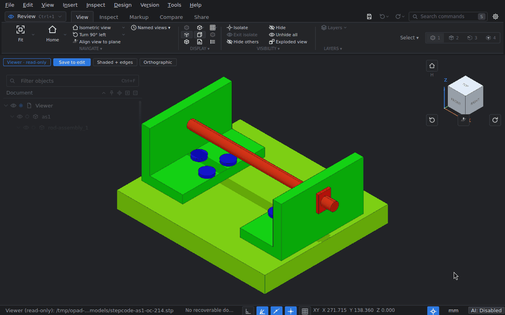
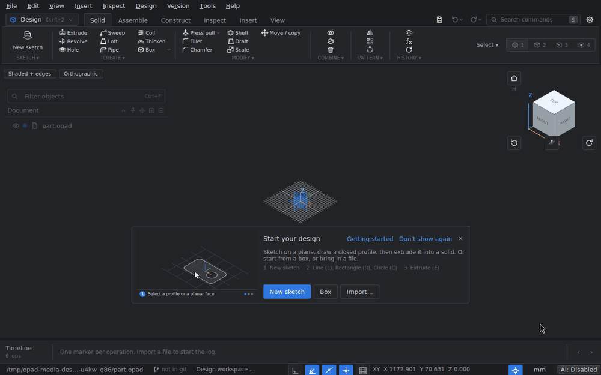
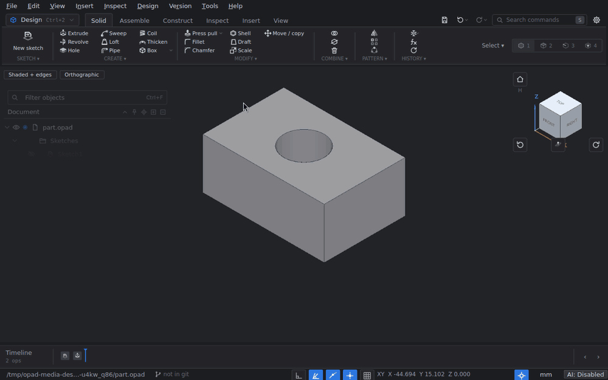
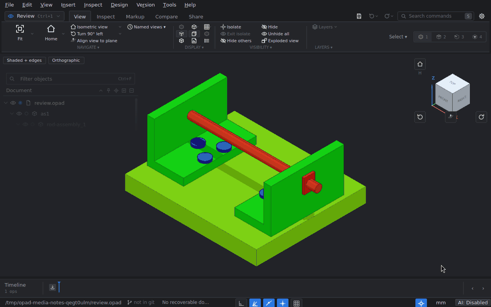
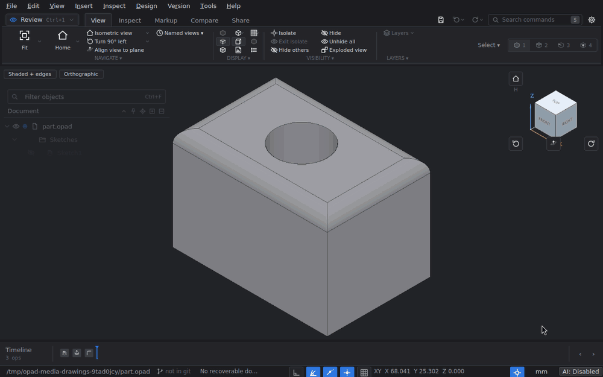
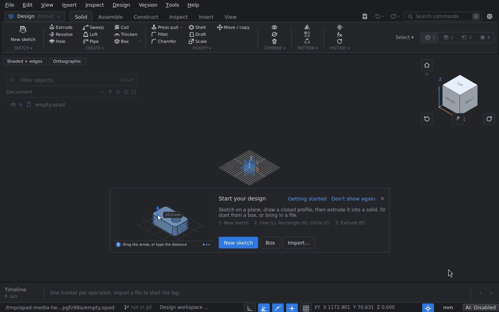
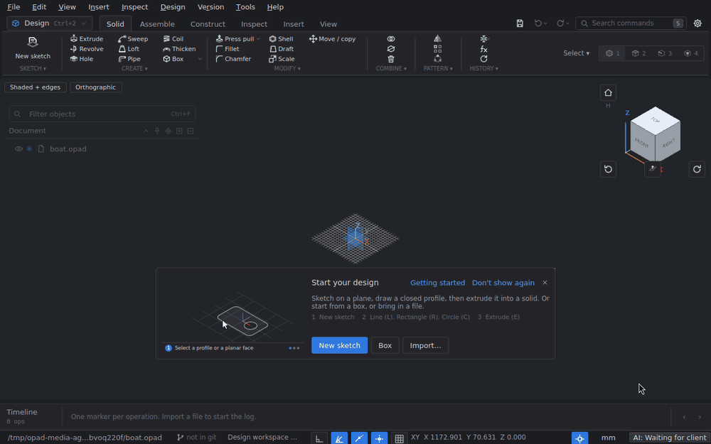
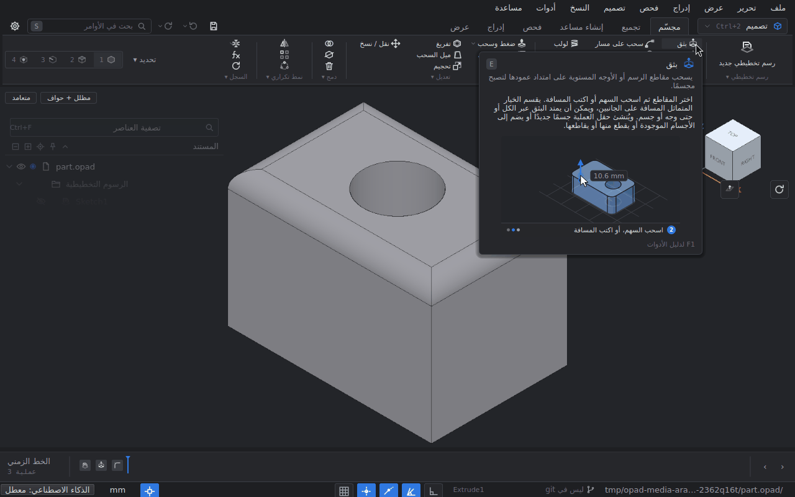
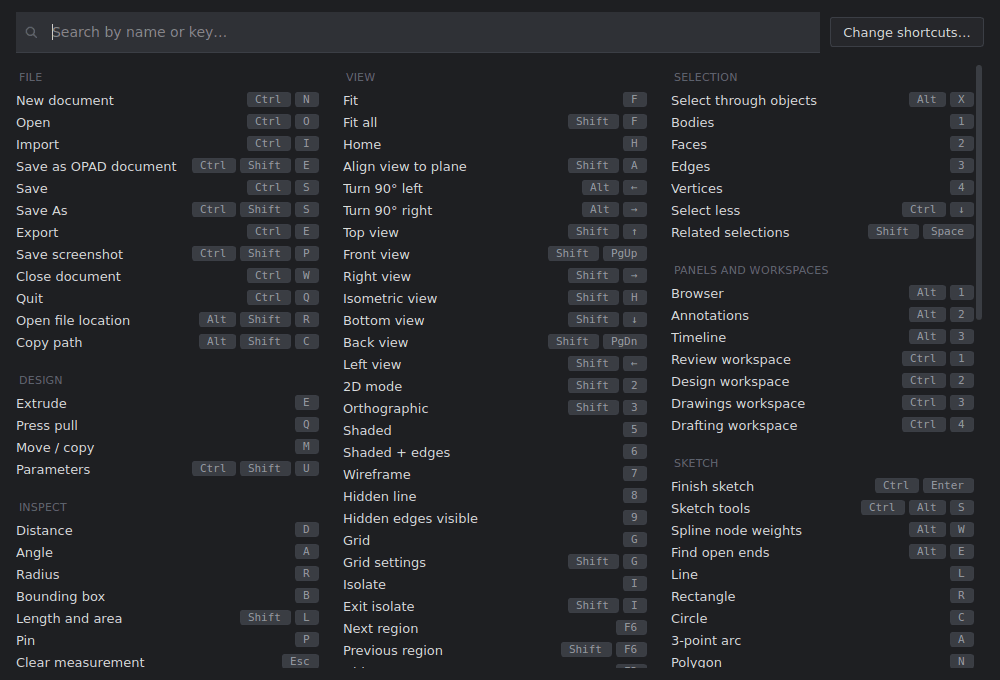

<div align="center">
  <picture>
    <source media="(prefers-color-scheme: dark)" srcset="docs/media/opad-logo-dark.png">
    
  </picture>
  <br>
  <br>
  <b>Open anything CAD, measure it, mark it up, model it, and keep it all in one text file that git can merge.</b>
  <br>
  <br>

  
  
  
  
  
  
</div>

<p align="center">
  
</p>

## Elevator pitch

CAD files are usually locked inside one program, one cloud account or one binary format. You wait for them to open,
you cannot see what changed between two versions, and a colleague (or an AI agent) who wants to look at a part has to
install the same thing you did.

OPAD is a desktop CAD program built the other way round. It opens STEP, IGES, meshes, DXF/DWG drawings and KiCad
boards in a fast read-only viewer, lets you measure, section, explode and annotate them, and when you want to change
something it turns the file into an `.opad` document: one plain UTF-8 file whose history is a readable log of
operations and whose geometry is content-addressed text, so `git diff` shows what changed and `git merge` merges it.
On top of that it is a parametric modeller (sketch, extrude, fillet, edit the history), a technical-drawing tool
(sheets, views, dimensions, PDF) and a scriptable kernel that the same commands drive from the CLI, Python or an AI
agent over MCP.

It runs locally, needs no account and no server, and is built on Open CASCADE and Qt.

### What OPAD tries to be

These come from how the code is built, not from a wish list:

- **The window never freezes.** Anything whose cost grows with the model (reading, meshing, measuring, selecting
  thousands of edges) runs on a worker or in small slices between events. Every long job goes through one runner that
  shows progress after half a second and has a Cancel button, and a watchdog reports any stall of the UI thread.
- **Open anything, fast.** Opening a non-OPAD file is *viewer mode*: no healing, no hashing, no conversion until you
  ask to edit. Slow files are remembered with their display meshes, so the second open of an unchanged big STEP skips
  the translation (a 45 MB transmission: 23 s, then 1.8 s).
- **One document, one timeline, one readable file.** Everything you do is an operation appended to the document's
  log; undo, redo and saving never rewrite earlier lines. Bodies are stored once, keyed by the SHA-256 of their BREP
  text, so an unchanged part never shows up in a diff. A record-aware merge driver and a semantic `diff` ship with it.
- **Keyboard first, and your keys everywhere.** Every command is in one registry that drives the menus, the ribbon,
  the command search and the shortcut editor. Every binding can be changed, and every place that shows a key (help
  cards, clips, prompts, the cheat sheet) shows *your* binding.
- **Help that is true to the tool.** All 389 commands have a help card and 281 have an animated clip; tests fail when a
  command has no help, when a clip's steps disagree with the tool's, or when a help text names a key literally.
- **Made to be driven by programs.** The desktop, `opad-cli`, the Python module, C plugins and the MCP servers all go
  through the same command layer, and a live MCP bridge lets an agent work in the window you are looking at.
- **Offline and portable.** A single-file Windows executable and a portable folder build exist; settings, cache and
  data stay on your machine.

## Contents

- [Features](#features)
  - [Viewer mode: open anything](#viewer-mode-open-anything)
  - [Guided measuring](#guided-measuring)
  - [Parametric design](#parametric-design)
  - [Edit the history](#edit-the-history)
  - [Notes and hand drawing](#notes-and-hand-drawing)
  - [Technical drawings](#technical-drawings)
  - [Help that shows the real tool](#help-that-shows-the-real-tool)
  - [AI agents over MCP](#ai-agents-over-mcp)
  - [Git-native documents](#git-native-documents)
  - [Command line and Python](#command-line-and-python)
  - [Arabic and right-to-left](#arabic-and-right-to-left)
  - [And also](#and-also)
- [Installation](#installation)
- [Usage](#usage)
  - [Keybindings](#keybindings)
- [Configuration](#configuration)
- [Contributing](#contributing)
- [FAQ](#faq)
- [Alternatives](#alternatives)
- [Licence](#licence)

## Features

### Viewer mode: open anything

Open a STEP (AP203/AP214/AP242, assemblies included), IGES, BREP, STL, 3MF, OBJ, PLY, glTF/GLB, VRML, DXF, DWG, SVG or
KiCad board and it comes up read-only and fast, with its names, colours and assembly structure. Hover, isolate,
hide, section, explode and measure freely; the file you opened is never written. Anything that edits asks to save
first: **Save to edit** turns it into an OPAD document in place, keeping what you hid and coloured and the meshes
already on screen. Opening another file while one loads drops the first load, and a translucent shade with a spinner
covers the view while anything loads. DWG is read through LibreDWG's converter, built from a submodule and shipped
beside OPAD.

The picture at the top of this page is viewer mode on the STEPcode AS1 test assembly: hover, orbit (Fusion-style
mouse by default; SOLIDWORKS-, Onshape-, Blender-style and a 2D drafting preset are in the settings) and the
exploded view (Shift+E).

### Guided measuring

Distance (D), Angle (A), Radius (R), Bounding box (B), Length and area (Shift+L) and Area start first and then ask for
their picks: a prompt at the top of the view names each step, the tool panel lists them, a click on something already
picked un-picks it, and Esc steps back one level at a time. Distances are exact (minimum, centre to centre or maximum)
with their ΔX/ΔY/ΔZ; Radius recognises a B-spline face that is really a cylinder. The measurement runs on a worker, so
picking stays instant on big assemblies. **Pin** (P) keeps a measurement in the document.


### Parametric design

The Design workspace (Ctrl+2) is a history-based modeller. Sketches have a constraint solver, driving dimensions,
snaps that become constraints and value boxes beside the pointer: start Rectangle (R), type the corner (X, Tab, Y,
Enter) and the size (width, Tab, height, Enter), and the dimensions are there. Features cover extrude, revolve, sweep, loft, pipe, coil, hole, fillet,
chamfer, shell, draft, press pull, remove faces, thicken, combine, split, mirror, patterns, move/copy, primitives and
construction planes and axes, all with drag arrows and typed values. Parameters are named expressions usable in any
field.



### Edit the history

Every feature stays editable on the timeline. Double-click a marker, change a value, and everything after it is
regenerated: the fillets below follow the taller extrude. References to faces and edges survive regeneration, and a
feature can be suppressed, rolled back to, or suppressed by an expression over the parameters.



### Motion and simulation

The Simulate workspace (Ctrl+5) turns an assembly into a mechanism. Joints (revolute, slider, cylindrical, ball, planar,
pin-in-slot, screw, rigid, ground) go on a picked edge or face, with limits and locks; gear, rack-and-pinion and
lead-screw relations couple joints, also inside a planetary carrier. A joint's slider moves the mechanism through the
kinematic solver, and every study is an op on the timeline:

- **Motion**: joints driven over time, traced points, values, speeds and accelerations;
- **Dynamic** (Project Chrono): masses from the materials, gravity, motors (position, speed, torque), springs,
  friction, end stops and contacts, with reactions, motor torque and power and energies plotted;
- **Static** and **Vibration modes** (Netgen meshes, CalculiX): fixed supports, forces, pressures, gravity and bolt
  preload in load cases, then von Mises stress, displacement, safety factors and mode shapes as colour maps;
- **Printed parts**: a structural study's bodies as 3D printed, from the filament and the slicer's settings (typed in,
  or read from a PrusaSlicer, OrcaSlicer, Bambu Studio or Cura profile, a .3mf project or a G-code file): walls, top and
  bottom skins and infill each get the stiffness and strength of printed roads along, across and between layers, and
  the study says where the part fails first, how (along the roads, across them, between layers) and on which layer;
- **Thermal**: heat sources, fixed temperatures, convection (still air, moving air, or a known coefficient), radiation
  and fans through finned heatsinks, steady or over time: temperatures, where the heat goes, each fan's operating
  point and air temperature rise, the heatsink's °C/W; or, with OpenFOAM, the air itself solved around the parts
  (conjugate heat transfer) with streamlines.

Each engine is checked against textbook cases: a pendulum's period, a slider-crank's energy balance, a screw jack's
torque, a planetary set's Willis ratio, a cantilever's deflection and first frequency, a plate with a hole's stress
concentration, a bolt's preload stress, and a printed cantilever against composite beam theory. `tools/sim_eval.py` builds a dozen such mechanisms through MCP and reports
them; [docs/features.md](docs/features.md#motion-and-simulation) has the details. New to it? The
[simulation guide](docs/simulation-guide.md) takes ten use cases step by step, and **Simulation guide** in the app
(Simulate ribbon, Help menu, the panel's Step-by-step guides) does the same with buttons for each tool.

### Notes and hand drawing

Note (N) and Hand drawing (Shift+N) ask for their target like the measuring tools, then pin to it. Each stroke lies on
a plane that faces the camera when you start it, so orbiting between strokes builds a 2.5D sketch around the part.
Notes have types (OK, Warning, Issue, Note, and **AI agent notes**: requests an agent picks up over MCP), comment
threads, and are one undo step each.



### Technical drawings

The Drawings workspace (Ctrl+3) makes sheets from the model: ISO or ANSI templates (or your own DXF/DWG title block),
base, projected, isometric, section, detail, auxiliary, broken-out, cropped and broken views, drawn by a hidden-line
engine on workers. Dimensions with tolerances and fits, centre marks, hole callouts and tables, datums, feature control
frames, surface texture, parts lists with balloons and a revision table. Sheets export to PDF, SVG, DXF, DWG or PNG,
print at actual size, and **Issue revision** freezes a sheet as issued.



### Help that shows the real tool

Hover a ribbon button and its card plays an animated clip of what the tool does, with your current keys. F1 opens the
guide of the tool you are using, S searches every command (with the reason when one is not available now), ?
shows the cheat sheet, and Help > Getting started has short animated lessons.



### AI agents over MCP

`opad-cli mcp` is a headless stdio MCP server over the whole command layer. With **Tools > AI integration** turned on,
`opad-cli mcp --live` connects an agent to the running window instead: it lists open windows, binds to one, and every
write is checked against the document's revision, can be staged in a transaction or previewed, and is one undo step
for you. Both servers ship an agent guide (`opad://guide/agent`) with the modelling conventions. The setup page
registers OPAD with Codex, or gives MCP JSON for other local clients and VS Code; **Agent activity** shows what a
connected agent is doing and stops it.



This is `tools/test_agent_benchy.py`, one of the acceptance tests, run against a visible window with a pause after
each write.

### Git-native documents

An `.opad` file is a header, an append-only log of JSON operation records and a store of BREP bodies keyed by their
SHA-256. Saving appends; existing lines are written back byte for byte.

```text
#opad 2
{"uuid":"7c1c...","units":"mm","created":"2026-09-15T14:10:40Z","generator":"opad/0.1.0"}
#ops
{"op":"import","id":"6dda...","ts":"...","by":"alice","source":"gearbox.step","units":"mm","nodes":[...]}
{"op":"annotation","id":"1ffe...","ts":"...","by":"alice","anchor":{"body":"9dc9...","kind":"face","index":12},"text":"deburr"}
#bodies
#body a0d6fc12...058d 310 {"name":"Housing","color":[0.2,0.5,0.8],"units":"mm","source":"gearbox.step"}
...OCCT ASCII BREP...
```

- A record-aware **merge driver** (built into `opad-cli` and the desktop program) merges independent records and stops
  on real conflicts; `textconv` makes `git diff` and `git log -p` print a readable outline instead of BREP text.
- `opad-cli diff` compares two versions semantically: parameters, sketches, feature inputs before and after, bodies
  added, removed, moved or changed.
- In the desktop program: **Set up repository**, a Version control panel (commit, push, pull with a preview of what the
  merge does, branches, history), **Resolve conflicts** change by change, **Compare versions** with the changes tinted
  over the old version's ghosts, recovery snapshots, linked assets (big files read from beside the document instead of
  copied in) and a save guard that never writes over a file that changed on disk.

### Command line and Python

```sh
opad-cli new review.opad
opad-cli import review.opad gearbox.step --by alice
opad-cli tree review.opad                       # component/body hierarchy as JSON
opad-cli inspect review.opad <body-uuid>/face/12
opad-cli annotate review.opad <body-uuid> "check wall thickness here" --by alice
opad-cli export review.opad --format stl --out housing.stl --select <component-uuid>
opad-cli render review.opad --view iso --out shot.png
git add review.opad && git commit -m "review gearbox"
```

Every command prints JSON; `opad-cli commands` lists them with their argument schemas, and they are the same commands
the MCP servers expose. `OPAD_DETERMINISTIC=<seed>` makes a scripted build write the same bytes every time. The
`opad` Python module (pybind11) runs the same commands and exchanges OCCT BREP with OCP, CadQuery and build123d:

```python
import opad
d = opad.Document.create()
d.import_step("gearbox.step", by="agent")
plate = d.tree()["roots"][0]["children"][0]["id"]
print(d.properties(plate)["bbox"])
d.save_as("gearbox.opad")
```

### Arabic and right-to-left

The desktop program ships English and Arabic. In Arabic the whole window runs right to left, drawings shape Arabic
text with HarfBuzz, and the help clips and cards are translated too. A language is one JSON file
(`app/i18n/<code>.json`), and `python tools/i18n_check.py` lists what a translation does not cover yet.



### And also

- **Compare and recovery**: two versions side by side or overlaid, `]` and `[` to step through the changes;
  recovery snapshots shown as a diff against the file.
- **Assemblies**: activate a component (new work goes into it, the rest is ghosted), lock, smart selection (pick a
  face and select its whole feature, hole or fillet), Select similar, interference and 3D-print checks.
- **2D files**: DXF/DWG/SVG open in 2D mode with layers, linetypes, shaped text and SHX fonts; Draw on drawing and
  Drawing to sketch take them into a design; Plot to PDF.
- **KiCad**: a `.kicad_pcb` opens as the board with its footprints' 3D models, linked and synced when the board
  changes.
- **Image canvases**: place a picture on a plane, calibrate it, trace it into a sketch.
- **Bills of materials** with part properties, a material library and masses; CSV export.
- **Windows integration**: file associations and Explorer thumbnails of models and drawings.

[docs/features.md](docs/features.md) describes most of these, and everything above, in more detail.

## Installation

There are no published binaries yet; OPAD is built from source. Windows (MSYS2, MinGW-w64) and Ubuntu 24.04 are built
and tested; a macOS preset exists but has not been run.

```sh
git clone --recurse-submodules <this repository>
cd opad

# Windows, in an MSYS2 shell (C:\msys64\mingw64\bin first on PATH):
pacman -S mingw-w64-x86_64-{cmake,ninja,gcc,opencascade,qt6-base,nlohmann-json,pybind11,python}
cmake --workflow --preset windows            # configure, build and test; programs in build/windows/bin

# Ubuntu 24.04 (the first configure builds Open CASCADE 7.9.2, about 15 minutes, once):
sudo apt install cmake ninja-build g++ pkg-config qt6-base-dev libqt6opengl6-dev nlohmann-json3-dev \
  libfreetype-dev libfontconfig-dev libharfbuzz-dev libzstd-dev libgl-dev libglu1-mesa-dev libx11-dev \
  libxext-dev libxi-dev rapidjson-dev pybind11-dev python3-dev libeigen3-dev xvfb
cmake --workflow --preset linux              # programs in build/linux/bin
```

The other packagings are one preset each: `cmake --workflow --preset windows-single` (one self-contained exe),
`cmake --build --preset windows-portable` (a folder with every DLL, plus a zip), `linux-single` (AppImage) and
`macos-single` (dmg; not run yet). [docs/building.md](docs/building.md) has the details: requirements, options,
the Linux OCCT build, the portable and single-file packages, the Python wheel, the GUI test benches and how the
pictures on this page are made.

## Usage

```sh
opad                         # the start page
opad model.step              # viewer mode: read-only and fast; Save to edit makes it an OPAD document
opad design.opad             # an OPAD document, editable
opad --read-only design.opad # look without changing it
opad --compare old.opad design.opad   # compare a version (a file or git:REV) with the file opened
opad-cli <command> [doc] [--key value ...]   # the same commands, headless, JSON out
```

The window has five workspaces: **Review** (Ctrl+1: view, inspect, mark up, compare, share), **Design** (Ctrl+2:
sketches, features, assembly), **Drawings** (Ctrl+3: sheets), **Drafting** (Ctrl+4: 2D files) and **Simulate**
(Ctrl+5: joints, motion, dynamics, stress and vibration). Workspaces only swap the ribbon; there is one document and one
timeline.

### Keybindings

The defaults, all changeable in **Keyboard shortcuts** (Ctrl+K). ? (Shift+/) shows this sheet in the program, with your
own bindings:



| | |
|---|---|
| **S** search commands | **F1** help for the tool in use · **?** cheat sheet |
| **F** fit · **Shift+F** fit all · **H** home | **Shift+H** isometric · **Shift+arrows**, **Shift+PgUp/PgDn** standard views |
| **1** / **2** / **3** / **4** pick bodies / faces / edges / vertices | **5**-**9** display styles · **G** grid · **/** hover highlight · **Ctrl+/** X-ray highlight |
| **I** isolate · **V** hide · **Shift+V** unhide all | **X** section · **Shift+E** exploded view |
| **D** distance · **A** angle · **R** radius · **B** box | **N** note · **Shift+N** hand drawing · **P** pin |
| **E** extrude · **Q** press pull · **M** move/copy | sketch: **L** line, **R** rectangle, **C** circle, **D** dimension, **U** slot, **N** polygon, **T** trim, **O** offset |
| **Ctrl+Enter** finish sketch / save a note | **Esc** steps back one level · **Shift+Enter** repeat |

Inside a tool, digits go into the value boxes beside the pointer: type a value, Tab to the next, Enter to apply.
A tap of Alt shows key tips on the ribbon; F6 moves between the ribbon, browser, view, timeline and panels.

## Configuration

Everything is in **Preferences** (the gear, or Ctrl+,), with a search: navigation preset, what a scroll does (mouse
wheel or trackpad), rendering presets and backgrounds, the theme, the display name recorded on notes and history, the
language, undo depth, viewer mode, file types, linked-file trust, KiCad model folders, version control and AI access.

- Settings live in the usual per-user place (the registry on Windows, `~/.config/opad` on Linux) and the cache in
  `%LOCALAPPDATA%\opad\cache` or `$XDG_CACHE_HOME/opad` (`OPAD_CACHE_DIR` moves it). The portable folder (with its
  `opad.portable` file) and the single-file exe keep both beside the program instead.
- `OPAD_AUTHOR` sets the author name recorded on operations and notes (else the git or system user name); `OPAD_LANG=ar` runs the program in Arabic once;
  `OPAD_TRACE=<file>` logs job timings and UI stalls.

## Contributing

Issues and pull requests are welcome. Before sending a change:

- Build and run the unit tests with your OS's preset (`cmake --workflow --preset windows` or `linux`). Desktop
  behaviour is covered by in-app benches: `ctest --preset windows-gui`, or one case with
  `python tools/gui_benches.py <opad> <opad-cli> --only <case>`; add a case when you fix something the desktop does.
- Nothing that grows with the model may run on the UI thread: use the job runner (`app/Jobs.hpp`).
- A feature area is one `AreaController` (`app/AreaController.hpp`) that adds its actions, ribbon slots and panels
  through hooks; new `app/*.cpp` and `tests/test_<name>.cpp` files are picked up by CMake without edits.
- Every new command needs a help record in `app/help/commands.json` and `commands.ar.json` (the help test fails
  without it), and visible strings go through `tr()` with their Arabic in `app/i18n` (`python tools/i18n_check.py`).
- Keep text files UTF-8 with LF line endings.

## FAQ

**Is it free? Does it need an account or a connection?**
The code is MIT-licensed, and OPAD runs entirely on your machine. It goes online only through git (your remotes,
including a background fetch every 10 minutes in a repository that has one, which you can turn off) and when you
accept its offer to download KiCad library models for a board.

**Can other CAD programs read my work?**
Export to STEP (AP203/214/242), STL, OBJ, GLB, and drawings to PDF, DXF, DWG, SVG and PNG. The `.opad` format itself
is plain text: the body store is OCCT ASCII BREP and the history is JSON.

**Will a newer OPAD's file open in an older one?**
Record types a build does not know are kept as they are, listed as needing a newer OPAD and saved back unchanged.
Builds older than that tolerant loader refuse such files.

**How big a model can it take?**
It is developed against a 1,295-body engine assembly (374 MB of STEP); everything slow on that model is a bug, by the
rule above.

**What is it not (yet)?**
There are no 3D annotations (PMI), no paper-space layouts as sheets and no installers yet; DXF
and DWG open read-only (edit them through Draw on drawing or Drawing to sketch); the embedded Python console is not
there; macOS has not been built.

## Alternatives

- **FreeCAD**: the established open-source parametric modeller, with far more workbenches. OPAD is younger and
  narrower, but it is built around a viewer that opens big files fast, a UI that never blocks, and a text format meant
  for git.
- **Fusion, SOLIDWORKS, Onshape**: mature commercial modellers. Onshape has real version control, on its servers;
  OPAD does it locally with git.
- **CadQuery and build123d**: CAD as Python code. OPAD exchanges BREP with them and can be scripted, but its document
  is a history of operations, not a program.
- **eDrawings, DWG TrueView and other viewers**: view and measure; OPAD views, measures, marks up and keeps the review
  in a diffable file.

## Licence

OPAD's own code is MIT ([LICENSE](LICENSE)). It is built on Open CASCADE Technology (LGPL 2.1 with the OCCT
exception), Qt 6 (LGPL 3) and other libraries under their own licences. Every build lists them with versions, licences
and where their source is: Help > Third-party licences, `opad-cli licenses`, and `THIRD-PARTY-NOTICES.txt` in each
package (generated by `cmake/notices.cmake` from the link libraries or the shipped DLLs).

- The `windows` build and the portable package link Qt, OCCT and the rest **dynamically**: each is a separate DLL that
  can be replaced. MSYS2's OCCT pulls in FFmpeg (GPL 3, with the x264/x265/xvid encoders), FreeImage and OpenVR, which
  OPAD never uses; the portable target refuses to stage them unless `-DOPAD_ALLOW_GPL_DLLS=ON`, and such a package must
  not be distributed. An OCCT built without them (as the single-file build does) is needed before the portable zip can
  be handed out. The AppImage and the dmg apply the same guard to the libraries they bundle (distribution OCCT
  packages are often built with FFmpeg and FreeImage too); `cmake/wheel_guard.cmake` checks a repaired Python wheel.
- The single-file build (`windows-static`, `opad-single`) links Qt, OCCT, FreeType, HarfBuzz, glib, libintl, graphite2
  and the other libraries in its notices **statically**. The LGPL requires that recipients can relink such an
  executable with modified versions of those libraries; how that is offered (OPAD's source, or its object files and
  link command, with each release) is not decided yet, so do not distribute the single-file exes until it is.
- The simulation engines are built from source with OPAD (cmake/sim_engines.cmake) and linked as shared libraries:
  Project Chrono (BSD-3-Clause; its collision detection is Bullet, Zlib) for dynamic studies and Netgen (LGPL 2.1) for
  the meshes of static and modal studies, which every package lists with their licence texts like the libraries above.
  Eigen (MPL 2.0) is compiled in from its headers, its MPL parts only. The single-file build leaves both engines out
  (`OPAD_CHRONO` and `OPAD_NETGEN` off in `windows-static`) until it can link them statically: Chrono's licence allows
  that with its notice; Netgen's LGPL would bring the same relinking offer as Qt and Open CASCADE above.
- CalculiX's `ccx` (GPL 2), which static and modal studies run, is a separate program found on the PATH, beside OPAD or
  through `OPAD_CCX`; OPAD never links or ships it.
- LibreDWG's `dwg2dxf` / `dxf2dwg` (GPL 3 or later) are separate programs that OPAD runs and never links; the portable
  package carries their licence, notice, source archive and build scripts in `licenses/LibreDWG/`.
- The ODA File Converter is third-party software that OPAD runs for DWG only when switched on (Preferences > Files);
  OPAD never bundles or downloads it.
- Drawings are lettered in Liberation Sans and Noto Sans Arabic (SIL Open Font License 1.1), compiled into the programs
  from `third_party/fonts`, where their licences are; the portable package carries them in `licenses/`.
- The models in the pictures on this page are the STEPcode AP214 AS1 test assembly (BSD) and parts made in OPAD.

Trademarks: Autodesk, AutoCAD, DWG, DWG TrueView, Fusion and ViewCube are trademarks of Autodesk, Inc.; SOLIDWORKS and
eDrawings of Dassault Systèmes; Onshape of PTC Inc.; Blender of the Blender Foundation; KiCad of the Linux Foundation;
Git of the Software Freedom Conservancy; Qt of The Qt Company; Open CASCADE of Open Cascade SAS; ODA and ODA File
Converter of the Open Design Alliance; Codex and ChatGPT of OpenAI. They are named only to describe compatibility;
OPAD is not affiliated with or endorsed by any of them.
